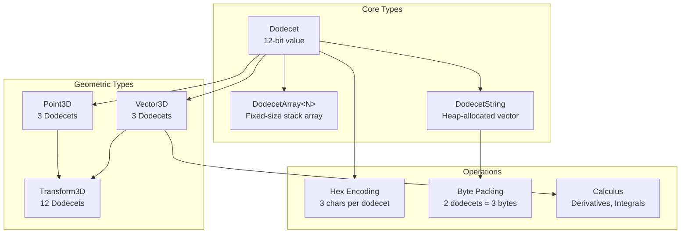
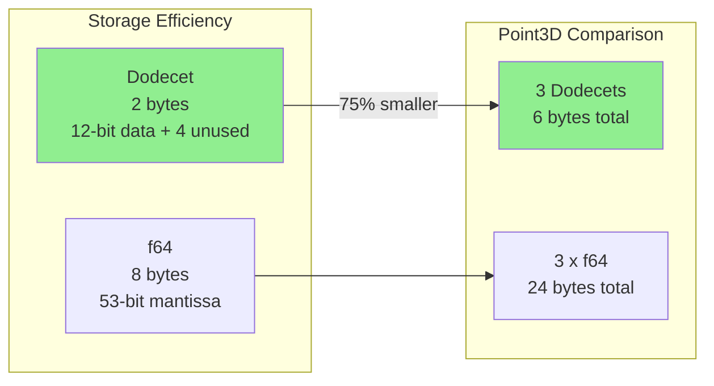

# Dodecet Encoder

**A 12-bit encoding system for geometric and calculus operations.**

[](https://opensource.org/licenses/MIT)
[](https://www.rust-lang.org/)

## What is a Dodecet?

A **dodecet** is a 12-bit unit (4,096 possible values) designed as an alternative building block for specific computational domains. The name comes from "dozen" (12) + "octet" (8 bits).

```
+---------------------------------------------------+
|                    DODECET (12 bits)              |
+---------------------------------------------------+
|  Bits 11-8  |  Bits 7-4   |  Bits 3-0   |  Storage |
|  Nibble 2   |  Nibble 1   |  Nibble 0   |  (u16)   |
+-------------+-------------+-------------+----------+
|    0xA      |    0xB      |    0xC      |   0x0ABC |
+-------------+-------------+-------------+----------+
```

### Key Property: Hex-Editor Friendly

Each dodecet maps to exactly **3 hexadecimal digits**:
- `0x000` to `0xFFF` (0 to 4095 in decimal)
- Easy visual inspection in hex editors
- Simple string encoding/decoding

```rust
use dodecet_encoder::Dodecet;

let d = Dodecet::from_hex(0xABC);
assert_eq!(d.to_hex_string(), "ABC");  // Exactly 3 hex chars
```

## When to Use Dodecets

### Good Use Cases

| Use Case | Why Dodecets Help |
|----------|-------------------|
| **3D Geometry** | One dodecet per axis (x,y,z) = compact coordinate storage |
| **Function Lookup Tables** | 4,096 values often sufficient for smooth interpolation |
| **Memory-Constrained Systems** | 2 bytes vs 8 bytes for f64 (75% savings) |
| **Network Transmission** | Compact hex representation, easy debugging |
| **Embedded/Edge Computing** | Predictable memory footprint |

### When to Avoid Dodecets

| Situation | Why Not Suitable |
|-----------|------------------|
| **High-Precision Calculations** | Only 12 bits vs f64's 53-bit mantissa |
| **Large Dynamic Range** | Range is 0-4095 vs f64's ~10^308 |
| **General-Purpose Computing** | Standard types (f32, f64, i32) have better tooling |
| **Scientific Simulations** | Accumulated quantization errors |
| **Financial Applications** | Precision requirements exceed 12 bits |

**Bottom Line**: Dodecets are a **domain-specific optimization**, not a general-purpose replacement for standard numeric types.

---

## Architecture Overview



---

## Quick Start

### Installation

```toml
# Cargo.toml
[dependencies]
dodecet-encoder = "0.1"
```

### Basic Usage

```rust
use dodecet_encoder::{Dodecet, DodecetArray, DodecetString};
use dodecet_encoder::geometric::{Point3D, Vector3D};

// Create a dodecet
let d = Dodecet::from_hex(0xABC);
println!("Hex: {}", d.to_hex_string());  // "ABC"
println!("Decimal: {}", d.value());       // 2748

// Access nibbles (4-bit groups)
assert_eq!(d.nibble(0).unwrap(), 0xC);  // Bits 3-0
assert_eq!(d.nibble(1).unwrap(), 0xB);  // Bits 7-4
assert_eq!(d.nibble(2).unwrap(), 0xA);  // Bits 11-8

// 3D Point (3 dodecets = 6 bytes)
let point = Point3D::new(0x100, 0x200, 0x300);
let distance = point.distance_to(&Point3D::new(0, 0, 0));
```

---

## Core Concepts

### 1. The Dodecet Type

```rust
use dodecet_encoder::Dodecet;

// Creation methods
let d1 = Dodecet::from_hex(0x123);           // From hex value
let d2 = Dodecet::new(1000).unwrap();        // Checked (returns error if >4095)
let d3 = Dodecet::from_hex_str("ABC").unwrap(); // From string

// Conversions
let normalized: f64 = d1.normalize();  // 0.0 to 1.0
let signed: i16 = d1.as_signed();      // -2048 to 2047

// Operations
let sum = d1.wrapping_add(d2);         // Wraps at 4096
let diff = d1.wrapping_sub(d2);
let product = d1.wrapping_mul(d2);
```

### 2. Arrays and Strings

```rust
use dodecet_encoder::{DodecetArray, DodecetString};

// Fixed-size array (stack allocated)
let arr = DodecetArray::<3>::from_slice(&[0x100, 0x200, 0x300]);
assert_eq!(arr.sum().value(), 0x600);

// Growable string (heap allocated)
let mut s = DodecetString::new();
s.push(0x123);
s.push(0x456);
assert_eq!(s.to_hex_string(), "123456");

// Byte packing: 2 dodecets = 3 bytes
let bytes = s.to_bytes();
let restored = DodecetString::from_bytes(&bytes).unwrap();
```

### 3. Geometric Operations

```rust
use dodecet_encoder::geometric::{Point3D, Vector3D, Transform3D};

// 3D points
let p1 = Point3D::new(100, 200, 300);
let p2 = Point3D::new(400, 500, 600);
let dist = p1.distance_to(&p2);  // Euclidean distance

// Vector math
let v1 = Vector3D::new(100, 200, 300);
let v2 = Vector3D::new(400, 500, 600);
let dot = v1.dot(&v2);           // Dot product
let cross = v1.cross(&v2);       // Cross product
let mag = v1.magnitude();        // Magnitude

// Transformations
let translate = Transform3D::translation(100, 200, 300);
let scale = Transform3D::scale(2.0, 2.0, 2.0);
let rotate = Transform3D::rotation_z(90.0);
let transformed = translate.apply(&p1);
```

---

## Memory Layout



### Trade-off Analysis

| Metric | Dodecet | f64 | Winner |
|--------|---------|-----|--------|
| Storage | 2 bytes | 8 bytes | Dodecet (4x) |
| Range | 0-4095 | +/-1.8e308 | f64 |
| Precision | 12 bits | 53 bits | f64 |
| Operations | Integer ops | FPU ops | Context-dependent |
| Memory bandwidth | Lower | Higher | Dodecet |

---

## Calculus Support

The library includes numerical methods for calculus operations:

```rust
use dodecet_encoder::calculus;

// Numerical derivative (finite differences)
let f = |x: f64| x * x;
let deriv = calculus::derivative(&f, 2.0, 0.01);
// f'(2) = 4.0, computed ~= 4.0

// Numerical integral (trapezoidal rule)
let integral = calculus::integral(&f, 0.0, 2.0, 1000);
// Integral of x^2 from 0 to 2 = 8/3 ~= 2.667

// Function encoding for fast lookup
let table = calculus::encode_function(
    &|x| x.sin(),
    0.0,
    std::f64::consts::TAU,
    360
);
let y = calculus::decode_function(&table, 0.0, std::f64::consts::TAU, 1.57);
// sin(pi/2) ~= 1.0
```

**Note**: These are **numerical approximations** using standard methods. They are not suitable for applications requiring exact symbolic computation or high-precision results.

---

## Performance Characteristics

### Measured Performance (Release Build)

| Operation | Time | Notes |
|-----------|------|-------|
| Dodecet creation | ~1-2 ns | Inline, const-constructible |
| Nibble access | ~1 ns | Bit extraction |
| Bitwise ops | ~0.5 ns | Native CPU operations |
| Distance calc | ~45 ns | Includes sqrt |
| Function decode | ~180 ns | With interpolation |

**Important**: Performance varies significantly by:
- Build configuration (debug vs release)
- CPU architecture
- Compiler version
- Data locality

Run `cargo bench` on your target hardware for accurate measurements.

---

## Hex Editor Integration

Dodecets are designed to be human-readable in hex editors:

```
Offset  +0    +1    +2    +3    +4    +5    +6    +7
--------+-----+-----+-----+-----+-----+-----+-----+----
00000000+123  456  789  ABC  DEF  012  345  678
         ^^^  ^^^  ^^^  ^^^
         |    |    |    +-- 4th dodecet: 0xABC
         |    |    +------- 3rd dodecet: 0x789
         |    +------------ 2nd dodecet: 0x456
         +----------------- 1st dodecet: 0x123
```

```rust
use dodecet_encoder::hex;

// Formatting utilities
let spaced = hex::format_spaced("123456789");  // "123 456 789"
let valid = hex::is_valid("123456");           // true
let invalid = hex::is_valid("12345");          // false (not multiple of 3)
```

---

## API Summary

### Core Types

| Type | Description | Size |
|------|-------------|------|
| `Dodecet` | 12-bit value | 2 bytes (u16 storage) |
| `DodecetArray<N>` | Fixed-size array | 2N bytes (stack) |
| `DodecetString` | Growable vector | 2N + overhead (heap) |

### Geometric Types

| Type | Description | Dodecets |
|------|-------------|----------|
| `Point3D` | 3D coordinate | 3 |
| `Vector3D` | 3D vector | 3 |
| `Transform3D` | 3x4 transform matrix | 12 |
| `Triangle` | 3 vertices | 9 |
| `Box3D` | Axis-aligned bounding box | 6 |

### Calculus Functions

| Function | Description |
|----------|-------------|
| `derivative` | Finite difference approximation |
| `integral` | Trapezoidal rule integration |
| `gradient` | Multivariate gradient |
| `laplacian` | Sum of second derivatives |
| `gradient_descent` | Optimization routine |
| `encode_function` | Create lookup table |
| `decode_function` | Interpolate from table |

---

## Examples

Run the included examples:

```bash
# Basic usage
cargo run --example basic_usage

# 3D geometry
cargo run --example geometric_shapes

# Hex visualization
cargo run --example hex_editor

# Pythagorean snapping (constraint theory)
cargo run --example pythagorean_snapping

# Comprehensive integration
cargo run --example comprehensive_integration
```

---

## Testing

```bash
# Run all tests
cargo test

# Run with verbose output
cargo test -- --nocapture

# Run benchmarks (release mode)
cargo bench
```

---

## Design Decisions

### Why 12 Bits?

1. **Hex alignment**: 12 = 4 x 3, maps to 3 hex digits cleanly
2. **3D geometry**: Good resolution for spatial coordinates
3. **Storage**: Fits in u16 with 4 unused bits (acceptable overhead)
4. **Historical precedent**: Nibbles (4 bits) are well-understood

### Why Not 8 or 16 Bits?

- 8 bits: Only 256 values, insufficient for 3D coordinates
- 16 bits: 65,536 values but requires 4 hex digits, less elegant

### Trade-offs Acknowledged

1. **Precision loss**: 12 bits < f32 (23-bit mantissa) < f64 (53-bit mantissa)
2. **Storage overhead**: 4 bits wasted per u16 (25% of storage)
3. **Ecosystem fit**: Standard libraries expect u8/u16/u32/f32/f64
4. **Operation cost**: Some conversions require computation

---

## Comparison with Standard Types

```rust
// Standard approach
let point_f64: (f64, f64, f64) = (1.234, 5.678, 9.012);
// Size: 24 bytes
// Precision: ~15 decimal digits
// Range: +/- 1.8e308

// Dodecet approach
let point_dodecet = Point3D::new(0x4D2, 0x162E, 0x2346);
// Size: 6 bytes (75% smaller)
// Precision: ~3 decimal digits
// Range: 0 to 4095 per axis
```

Choose based on your requirements:
- **Use dodecets** when memory/dominates and 12-bit precision is sufficient
- **Use f64** when precision or range matters more than memory

---

## Contributing

Contributions are welcome! Please:

1. Fork the repository
2. Create a feature branch
3. Add tests for new functionality
4. Ensure all tests pass (`cargo test`)
5. Submit a pull request

See [CONTRIBUTING.md](.github/CONTRIBUTING.md) for details.

---

## License

MIT License - see [LICENSE](LICENSE) file for details.

---

## References

- [SuperInstance Ecosystem](https://github.com/SuperInstance)
- [Constraint Theory Project](https://github.com/SuperInstance/constrainttheory)
- [API Documentation](https://docs.rs/dodecet-encoder)

---

## Disclaimer

This library is provided as-is for specialized use cases. It is **not** intended as a general-purpose replacement for standard numeric types. Users should carefully evaluate whether the precision and range limitations of 12-bit encoding are appropriate for their specific application.

The calculus functions use standard numerical approximation techniques and may not be suitable for applications requiring exact symbolic computation or certified numerical bounds.

---

*Built with Rust's performance and safety guarantees.*
