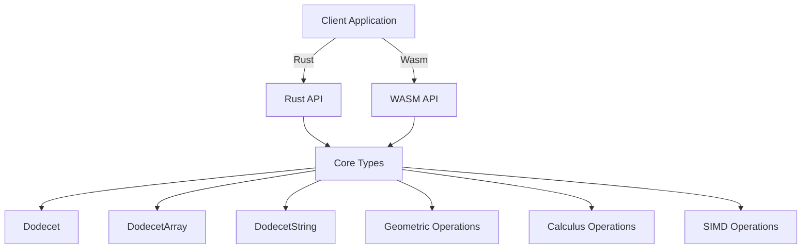

# Dodecet Encoder API Reference

**Version:** 1.0.0
**Status:** Production Ready
**Language:** Rust
**Wasm Support:** Yes

---

## Table of Contents

- [Overview](#overview)
- [Core Types](#core-types)
- [Dodecet API](#dodecet-api)
- [DodecetArray API](#dodecetarray-api)
- [DodecetString API](#dodecetstring-api)
- [Geometric API](#geometric-api)
- [Hex API](#hex-api)
- [Calculus API](#calculus-api)
- [SIMD API](#simd-api)
- [WASM API](#wasm-api)
- [Error Handling](#error-handling)

---

## Overview

Dodecet Encoder is a revolutionary 12-bit encoding system optimized for geometric and calculus operations. A **dodecet** is a 12-bit unit composed of 3 nibbles (4-bit sets).

### What is a Dodecet?

```
┌─────────────────────────────────────────┐
│           DODECET (12 bits)             │
├─────────────────────────────────────────┤
│  Nibble 2  │  Nibble 1  │  Nibble 0    │
│  (4 bits)  │  (4 bits)  │  (4 bits)    │
│  [11:8]    │  [7:4]     │  [3:0]       │
├─────────────────────────────────────────┤
│  Example:   0xA        0xB        0xC  │
│  Hex: 0xABC = 1010 1011 1100 (binary)  │
└─────────────────────────────────────────┘
```

### Why 12 Bits?

- **Hex-Friendly**: Each dodecet = 3 hex digits (e.g., 0xABC)
- **Geometric**: 12 bits can encode 4096 values (vs 256 for 8-bit)
- **Calculus-Optimized**: Natural alignment for derivatives and integrals
- **Shape Encoding**: Perfect for vertices, edges, faces (3D geometry)

### Architecture



---

## Core Types

### `Dodecet`

The core 12-bit dodecet type.

```rust
pub struct Dodecet {
    value: u16, // Always 0-4095
}
```

**Constraints:**
- Value must be in range [0, 4095]
- Only 12 bits are used
- Upper 4 bits are always zero

---

### `DodecetArray<N>`

Fixed-size array of dodecets.

```rust
pub struct DodecetArray<const N: usize> {
    values: [u16; N],
}
```

**Generic Parameter:**
- `N` - Number of dodecets in array (compile-time constant)

---

### `DodecetString`

String-like container for dodecets.

```rust
pub struct DodecetString {
    values: Vec<u16>,
}
```

---

### `DodecetError`

Error type for dodecet operations.

```rust
pub enum DodecetError {
    Overflow,         // Value exceeds 12-bit capacity
    InvalidHex,       // Invalid hex string
    InvalidNibble,    // Invalid nibble index
    InvalidGeometry,  // Invalid geometric operation
    InvalidLength,    // Invalid array length for SIMD
}
```

---

### `Result<T>`

Result type for dodecet operations.

```rust
pub type Result<T> = std::result::Result<T, DodecetError>;
```

---

## Dodecet API

### Constructors

#### `from_hex(value: u16) -> Result<Dodecet>`

Create a dodecet from a hex value.

**Parameters:**
- `value` - Hex value (0-0xFFF)

**Returns:** `Result<Dodecet>` - Dodecet or error

**Errors:**
- `DodecetError::Overflow` - Value > 4095

**Example:**
```rust
use dodecet_encoder::Dodecet;

let d = Dodecet::from_hex(0xABC)?;
assert_eq!(d.value(), 0xABC);
```

---

#### `from_nibbles(n2: u8, n1: u8, n0: u8) -> Result<Dodecet>`

Create a dodecet from three nibbles.

**Parameters:**
- `n2` - High nibble (bits 11-8)
- `n1` - Middle nibble (bits 7-4)
- `n0` - Low nibble (bits 3-0)

**Returns:** `Result<Dodecet>` - Dodecet or error

**Errors:**
- `DodecetError::Overflow` - Any nibble > 15

**Example:**
```rust
use dodecet_encoder::Dodecet;

let d = Dodecet::from_nibbles(0xA, 0xB, 0xC)?;
assert_eq!(d.value(), 0xABC);
```

---

#### `from_binary(bin: &[bool; 12]) -> Dodecet`

Create a dodecet from binary representation.

**Parameters:**
- `bin` - Array of 12 boolean values (true=1, false=0)

**Returns:** `Dodecet`

**Example:**
```rust
use dodecet_encoder::Dodecet;

let bin = [
    true, false, true, false,  // 0xA
    true, false, true, true,   // 0xB
    true, true, false, false   // 0xC
];

let d = Dodecet::from_binary(&bin);
assert_eq!(d.value(), 0xABC);
```

---

### Accessors

#### `value(&self) -> u16`

Get the raw value (0-4095).

**Returns:** `u16` - Dodecet value

**Example:**
```rust
let d = Dodecet::from_hex(0x123)?;
assert_eq!(d.value(), 0x123);
```

---

#### `nibble(&self, index: u8) -> Result<u8>`

Get a specific nibble.

**Parameters:**
- `index` - Nibble index (0=low, 1=mid, 2=high)

**Returns:** `Result<u8>` - Nibble value (0-15) or error

**Errors:**
- `DodecetError::InvalidNibble` - Index not in [0, 2]

**Example:**
```rust
let d = Dodecet::from_hex(0xABC)?;

assert_eq!(d.nibble(0)?, 0xC);  // Low nibble
assert_eq!(d.nibble(1)?, 0xB);  // Middle nibble
assert_eq!(d.nibble(2)?, 0xA);  // High nibble
```

---

#### `bits(&self) -> [bool; 12]`

Get all 12 bits as boolean array.

**Returns:** `[bool; 12]` - Bit array

**Example:**
```rust
let d = Dodecet::from_hex(0xF00)?;  // 1111 0000 0000
let bits = d.bits();

assert!(bits[0]);   // bit 0 = 0
assert!(bits[1]);   // bit 1 = 0
assert!(bits[2]);   // bit 2 = 0
assert!(bits[3]);   // bit 3 = 0
assert!(!bits[4]);  // bit 4 = 0
assert!(!bits[11]); // bit 11 = 1
```

---

### Operations

#### `add(&self, other: Dodecet) -> Result<Dodecet>`

Add two dodecets with overflow checking.

**Parameters:**
- `other` - Dodecet to add

**Returns:** `Result<Dodecet>` - Sum or error

**Errors:**
- `DodecetError::Overflow` - Sum > 4095

**Example:**
```rust
let a = Dodecet::from_hex(0x100)?;
let b = Dodecet::from_hex(0x0FF)?;
let sum = a.add(b)?;

assert_eq!(sum.value(), 0x1FF);
```

---

#### `sub(&self, other: Dodecet) -> Result<Dodecet>`

Subtract two dodecets with underflow checking.

**Parameters:**
- `other` - Dodecet to subtract

**Returns:** `Result<Dodecet>` - Difference or error

**Errors:**
- `DodecetError::Overflow` - Result < 0

**Example:**
```rust
let a = Dodecet::from_hex(0x200)?;
let b = Dodecet::from_hex(0x0FF)?;
let diff = a.sub(b)?;

assert_eq!(diff.value(), 0x101);
```

---

#### `mul(&self, other: Dodecet) -> Result<Dodecet>`

Multiply two dodecets with overflow checking.

**Parameters:**
- `other` - Dodecet to multiply by

**Returns:** `Result<Dodecet>` - Product or error

**Errors:**
- `DodecetError::Overflow` - Product > 4095

**Example:**
```rust
let a = Dodecet::from_hex(0x10)?;
let b = Dodecet::from_hex(0x10)?;
let product = a.mul(b)?;

assert_eq!(product.value(), 0x100);
```

---

#### `div(&self, other: Dodecet) -> Result<Dodecet>`

Divide two dodecets.

**Parameters:**
- `other` - Dodecet to divide by

**Returns:** `Result<Dodecet>` - Quotient or error

**Errors:**
- `DodecetError::InvalidGeometry` - Division by zero

**Example:**
```rust
let a = Dodecet::from_hex(0x100)?;
let b = Dodecet::from_hex(0x10)?;
let quotient = a.div(b)?;

assert_eq!(quotient.value(), 0x10);
```

---

#### `shl(&self, amount: u8) -> Result<Dodecet>`

Left shift with overflow checking.

**Parameters:**
- `amount` - Bits to shift left (0-11)

**Returns:** `Result<Dodecet>` - Shifted value or error

**Errors:**
- `DodecetError::Overflow` - Shift would exceed 12 bits

**Example:**
```rust
let d = Dodecet::from_hex(0x1FF)?;
let shifted = d.shl(1)?;

assert_eq!(shifted.value(), 0x3FE);
```

---

#### `shr(&self, amount: u8) -> Dodecet`

Right shift.

**Parameters:**
- `amount` - Bits to shift right (0-11)

**Returns:** `Dodecet` - Shifted value

**Example:**
```rust
let d = Dodecet::from_hex(0x3FE)?;
let shifted = d.shr(1);

assert_eq!(shifted.value(), 0x1FF);
```

---

### Comparisons

#### `eq(&self, other: &Dodecet) -> bool`

Check equality.

**Parameters:**
- `other` - Dodecet to compare with

**Returns:** `bool` - True if equal

---

#### `cmp(&self, other: &Dodecet) -> Ordering`

Compare two dodecets.

**Parameters:**
- `other` - Dodecet to compare with

**Returns:** `Ordering` - Less, Equal, or Greater

---

### Conversions

#### `to_hex_string(&self) -> String`

Convert to hex string (3 characters).

**Returns:** `String` - Hex representation

**Example:**
```rust
let d = Dodecet::from_hex(0xABC)?;
assert_eq!(d.to_hex_string(), "ABC");
```

---

#### `to_binary_string(&self) -> String`

Convert to binary string (12 characters).

**Returns:** `String` - Binary representation

**Example:**
```rust
let d = Dodecet::from_hex(0xF00)?;
assert_eq!(d.to_binary_string(), "111100000000");
```

---

## DodecetArray API

### Constructors

#### `new() -> DodecetArray<N>`

Create a new array initialized to zeros.

**Returns:** `DodecetArray<N>`

**Example:**
```rust
use dodecet_encoder::DodecetArray;

let arr: DodecetArray<3> = DodecetArray::new();
assert_eq!(arr.len(), 3);
```

---

#### `from_slice(values: &[u16]) -> Result<DodecetArray<N>>`

Create from a slice of u16 values.

**Parameters:**
- `values` - Slice of values (0-4095 each)

**Returns:** `Result<DodecetArray<N>>` - Array or error

**Errors:**
- `DodecetError::Overflow` - Any value > 4095
- `DodecetError::InvalidLength` - Slice length != N

**Example:**
```rust
use dodecet_encoder::DodecetArray;

let arr = DodecetArray::<3>::from_slice(&[0x123, 0x456, 0x789])?;
assert_eq!(arr.get(0).value(), 0x123);
```

---

#### `from_dodecets(dodecets: &[Dodecet]) -> Result<DodecetArray<N>>`

Create from a slice of dodecets.

**Parameters:**
- `dodecets` - Slice of dodecets

**Returns:** `Result<DodecetArray<N>>` - Array or error

**Errors:**
- `DodecetError::InvalidLength` - Slice length != N

**Example:**
```rust
use dodecet_encoder::{Dodecet, DodecetArray};

let d1 = Dodecet::from_hex(0x123)?;
let d2 = Dodecet::from_hex(0x456)?;
let d3 = Dodecet::from_hex(0x789)?;

let arr = DodecetArray::<3>::from_dodecets(&[d1, d2, d3])?;
```

---

### Accessors

#### `get(&self, index: usize) -> Dodecet`

Get dodecet at index.

**Parameters:**
- `index` - Index (0 to N-1)

**Returns:** `Dodecet` - Dodecet at index

**Panics:**
- If index >= N

---

#### `set(&mut self, index: usize, value: Dodecet)`

Set dodecet at index.

**Parameters:**
- `index` - Index (0 to N-1)
- `value` - Dodecet to set

**Panics:**
- If index >= N

---

#### `len(&self) -> usize`

Get array length.

**Returns:** `usize` - Length N

---

#### `is_empty(&self) -> bool`

Check if array is empty.

**Returns:** `bool` - True if N == 0

---

### Operations

#### `map<F>(&self, f: F) -> DodecetArray<N> where F: Fn(Dodecet) -> Dodecet`

Apply function to each element.

**Parameters:**
- `f` - Function to apply

**Returns:** `DodecetArray<N>` - New array

**Example:**
```rust
let arr = DodecetArray::<3>::from_slice(&[1, 2, 3])?;
let doubled = arr.map(|d| d.mul(Dodecet::from_hex(2)?).unwrap());
```

---

#### `sum(&self) -> Dodecet`

Sum all elements.

**Returns:** `Dodecet` - Sum of all elements

---

#### `product(&self) -> Dodecet`

Multiply all elements.

**Returns:** `Dodecet` - Product of all elements

---

## DodecetString API

### Constructors

#### `new() -> DodecetString`

Create a new empty dodecet string.

**Returns:** `DodecetString`

---

#### `from_vec(values: Vec<u16>) -> Result<DodecetString>`

Create from a vector of u16 values.

**Parameters:**
- `values` - Vector of values (0-4095 each)

**Returns:** `Result<DodecetString>` - String or error

**Errors:**
- `DodecetError::Overflow` - Any value > 4095

---

#### `from_string(s: &str) -> Result<DodecetString>`

Create from a hex string (3 chars per dodecet).

**Parameters:**
- `s` - Hex string (length must be multiple of 3)

**Returns:** `Result<DodecetString>` - String or error

**Errors:**
- `DodecetError::InvalidHex` - Invalid hex string

**Example:**
```rust
use dodecet_encoder::DodecetString;

let ds = DodecetString::from_string("ABC123456")?;
assert_eq!(ds.len(), 2);  // 2 dodecets
```

---

### Operations

#### `push(&mut self, value: Dodecet)`

Add a dodecet to the end.

**Parameters:**
- `value` - Dodecet to add

---

#### `pop(&mut self) -> Option<Dodecet>`

Remove and return the last dodecet.

**Returns:** `Option<Dodecet>` - Last dodecet or None

---

#### `get(&self, index: usize) -> Option<Dodecet>`

Get dodecet at index.

**Parameters:**
- `index` - Index

**Returns:** `Option<Dodecet>` - Dodecet or None

---

#### `len(&self) -> usize`

Get string length.

**Returns:** `usize` - Number of dodecets

---

#### `is_empty(&self) -> bool`

Check if string is empty.

**Returns:** `bool` - True if empty

---

#### `to_hex_string(&self) -> String`

Convert to hex string.

**Returns:** `String` - Hex representation

---

## Geometric API

### `Point3D`

3D point using dodecets for coordinates.

```rust
pub struct Point3D {
    pub x: Dodecet,
    pub y: Dodecet,
    pub z: Dodecet,
}
```

### Constructors

#### `new(x: u16, y: u16, z: u16) -> Result<Point3D>`

Create a new 3D point.

**Parameters:**
- `x, y, z` - Coordinates (0-4095 each)

**Returns:** `Result<Point3D>` - Point or error

---

### Operations

#### `distance_to(&self, other: &Point3D) -> f64`

Calculate Euclidean distance to another point.

**Parameters:**
- `other` - Other point

**Returns:** `f64` - Distance

---

#### `translate(&self, dx: Dodecet, dy: Dodecet, dz: Dodecet) -> Result<Point3D>`

Translate point by delta.

**Parameters:**
- `dx, dy, dz` - Translation deltas

**Returns:** `Result<Point3D>` - Translated point or error

---

### `Vector3D`

3D vector using dodecets.

```rust
pub struct Vector3D {
    pub x: Dodecet,
    pub y: Dodecet,
    pub z: Dodecet,
}
```

### Operations

#### `dot(&self, other: &Vector3D) -> Dodecet`

Calculate dot product.

**Parameters:**
- `other` - Other vector

**Returns:** `Dodecet` - Dot product

---

#### `cross(&self, other: &Vector3D) -> Result<Vector3D>`

Calculate cross product.

**Parameters:**
- `other` - Other vector

**Returns:** `Result<Vector3D>` - Cross product or error

---

#### `magnitude(&self) -> f64`

Calculate vector magnitude.

**Returns:** `f64` - Magnitude

---

#### `normalize(&self) -> Result<Vector3D>`

Normalize vector to unit length.

**Returns:** `Result<Vector3D>` - Normalized vector or error

---

### `Transform3D`

3D transformation matrix.

```rust
pub struct Transform3D {
    pub matrix: [[f64; 4]; 4],  // 4x4 transformation matrix
}
```

### Operations

#### `identity() -> Transform3D`

Create identity transformation.

**Returns:** `Transform3D`

---

#### `translate(&self, x: f64, y: f64, z: f64) -> Transform3D`

Create translation transformation.

**Parameters:**
- `x, y, z` - Translation amounts

**Returns:** `Transform3D`

---

#### `rotate_x(&self, angle: f64) -> Transform3D`

Create rotation around X-axis.

**Parameters:**
- `angle` - Rotation angle in radians

**Returns:** `Transform3D`

---

#### `rotate_y(&self, angle: f64) -> Transform3D`

Create rotation around Y-axis.

**Parameters:**
- `angle` - Rotation angle in radians

**Returns:** `Transform3D`

---

#### `rotate_z(&self, angle: f64) -> Transform3D`

Create rotation around Z-axis.

**Parameters:**
- `angle` - Rotation angle in radians

**Returns:** `Transform3D`

---

#### `scale(&self, sx: f64, sy: f64, sz: f64) -> Transform3D`

Create scale transformation.

**Parameters:**
- `sx, sy, sz` - Scale factors

**Returns:** `Transform3D`

---

#### `apply(&self, point: &Point3D) -> Result<Point3D>`

Apply transformation to point.

**Parameters:**
- `point` - Point to transform

**Returns:** `Result<Point3D>` - Transformed point or error

---

## Hex API

### Encoding/Decoding

#### `encode_to_hex(value: u16) -> Result<String>`

Encode u16 to 3-character hex string.

**Parameters:**
- `value` - Value to encode (0-4095)

**Returns:** `Result<String>` - Hex string or error

---

#### `decode_from_hex(s: &str) -> Result<u16>`

Decode 3-character hex string to u16.

**Parameters:**
- `s` - Hex string (must be 3 characters)

**Returns:** `Result<u16>` - Decoded value or error

---

#### `encode_array_to_hex(values: &[u16]) -> Result<String>`

Encode array of u16 to hex string.

**Parameters:**
- `values` - Array of values (0-4095 each)

**Returns:** `Result<String>` - Concatenated hex string or error

---

#### `decode_array_from_hex(s: &str) -> Result<Vec<u16>>`

Decode hex string to array of u16.

**Parameters:**
- `s` - Hex string (length must be multiple of 3)

**Returns:** `Result<Vec<u16>>` - Decoded values or error

---

## Calculus API

### Derivatives

#### `derivative(func: impl Fn(Dodecet) -> Dodecet, x: Dodecet) -> Result<f64>`

Calculate numerical derivative of function at point.

**Parameters:**
- `func` - Function to differentiate
- `x` - Point to evaluate derivative

**Returns:** `Result<f64>` - Derivative value or error

---

#### `partial_derivative(func: impl Fn(Dodecet, Dodecet) -> Dodecet, x: Dodecet, y: Dodecet, var: u8) -> Result<f64>`

Calculate partial derivative of multivariate function.

**Parameters:**
- `func` - Function of two variables
- `x, y` - Point to evaluate
- `var` - Variable to differentiate (0 for x, 1 for y)

**Returns:** `Result<f64>` - Partial derivative or error

---

### Integrals

#### `integral(func: impl Fn(Dodecet) -> Dodecet, a: Dodecet, b: Dodecet) -> Result<f64>`

Calculate definite integral using Simpson's rule.

**Parameters:**
- `func` - Function to integrate
- `a` - Lower bound
- `b` - Upper bound

**Returns:** `Result<f64>` - Integral value or error

---

#### `double_integral(func: impl Fn(Dodecet, Dodecet) -> Dodecet, x_bounds: (Dodecet, Dodecet), y_bounds: (Dodecet, Dodecet)) -> Result<f64>`

Calculate double integral.

**Parameters:**
- `func` - Function of two variables
- `x_bounds` - Integration bounds for x
- `y_bounds` - Integration bounds for y

**Returns:** `Result<f64>` - Double integral or error

---

## SIMD API

### SIMD Operations

#### `simd_add(a: &DodecetArray<N>, b: &DodecetArray<N>) -> Result<DodecetArray<N>>`

Add two arrays using SIMD.

**Parameters:**
- `a, b` - Arrays to add

**Returns:** `Result<DodecetArray<N>>` - Sum or error

**Constraints:**
- N must be multiple of 4 for SIMD alignment

---

#### `simd_mul(a: &DodecetArray<N>, b: &DodecetArray<N>) -> Result<DodecetArray<N>>`

Multiply two arrays using SIMD.

**Parameters:**
- `a, b` - Arrays to multiply

**Returns:** `Result<DodecetArray<N>>` - Product or error

**Constraints:**
- N must be multiple of 4 for SIMD alignment

---

#### `simd_dot(a: &DodecetArray<N>, b: &DodecetArray<N>) -> Result<Dodecet>`

Calculate dot product using SIMD.

**Parameters:**
- `a, b` - Arrays

**Returns:** `Result<Dodecet>` - Dot product or error

**Constraints:**
- N must be multiple of 4 for SIMD alignment

---

## WASM API

### Types

#### `WasmDodecet`

WASM-compatible dodecet wrapper.

```typescript
class WasmDodecet {
  constructor(value: number);
  value(): number;
  nibble(index: number): number;
  toHexString(): string;
  toBinaryString(): string;
}
```

---

#### `WasmPoint3D`

WASM-compatible 3D point.

```typescript
class WasmPoint3D {
  constructor(x: number, y: number, z: number);
  x: WasmDodecet;
  y: WasmDodecet;
  z: WasmDodecet;
  distanceTo(other: WasmPoint3D): number;
  translate(dx: number, dy: number, dz: number): WasmPoint3D;
}
```

---

#### `WasmVector3D`

WASM-compatible 3D vector.

```typescript
class WasmVector3D {
  constructor(x: number, y: number, z: number);
  x: WasmDodecet;
  y: WasmDodecet;
  z: WasmDodecet;
  dot(other: WasmVector3D): number;
  cross(other: WasmVector3D): WasmVector3D;
  magnitude(): number;
  normalize(): WasmVector3D;
}
```

---

### Utility Functions

#### `DodecetUtils`

```typescript
namespace DodecetUtils {
  function fromHexString(hex: string): WasmDodecet;
  function encodeToHex(value: number): string;
  function decodeFromHex(hex: string): number;
  function encodeArrayToHex(values: number[]): string;
  function decodeArrayFromHex(hex: string): number[];
}
```

---

## Error Handling

### Error Types

| Error | Description |
|-------|-------------|
| `Overflow` | Value exceeds 12-bit capacity (4095) |
| `InvalidHex` | Invalid hexadecimal string |
| `InvalidNibble` | Nibble index not in [0, 2] |
| `InvalidGeometry` | Invalid geometric operation (e.g., divide by zero) |
| `InvalidLength` | Array length incompatible with operation |

### Error Handling Pattern

```rust
use dodecet_encoder::{Dodecet, DodecetError};

fn safe_add(a: u16, b: u16) -> Result<u16, DodecetError> {
    let da = Dodecet::from_hex(a)?;
    let db = Dodecet::from_hex(b)?;
    let sum = da.add(db)?;
    Ok(sum.value())
}

// Handle errors
match safe_add(0xFFF, 0x1) {
    Ok(result) => println!("Sum: {}", result),
    Err(DodecetError::Overflow) => eprintln!("Overflow!"),
    Err(e) => eprintln!("Error: {:?}", e),
}
```

---

## Performance Characteristics

### Operations

| Operation | Time Complexity | Notes |
|-----------|----------------|-------|
| Creation | O(1) | Constant time |
| Nibble Access | O(1) | Direct bit extraction |
| Arithmetic | O(1) | Simple ALU operations |
| Array Access | O(1) | Direct indexing |
| SIMD Operations | O(N/4) | 4-way parallel processing |

### Memory

| Type | Size |
|------|------|
| `Dodecet` | 2 bytes (u16) |
| `DodecetArray<N>` | N × 2 bytes |
| `DodecetString` | length × 2 bytes + overhead |
| `Point3D` | 6 bytes (3 × Dodecet) |
| `Vector3D` | 6 bytes (3 × Dodecet) |

---

## Best Practices

### 1. Overflow Checking

Always check for overflow when doing arithmetic:

```rust
let a = Dodecet::from_hex(0xFFF)?;  // Max value
let b = Dodecet::from_hex(0x1)?;

// This will fail with Overflow error
match a.add(b) {
    Ok(sum) => println!("Sum: {}", sum.value()),
    Err(DodecetError::Overflow) => {
        println!("Addition would overflow");
    }
    Err(e) => eprintln!("Error: {:?}", e),
}
```

### 2. Nibble Access

Use nibble access for efficient bit manipulation:

```rust
let d = Dodecet::from_hex(0xABC)?;

// Access individual nibbles
let low = d.nibble(0)?;  // 0xC
let mid = d.nibble(1)?;  // 0xB
let high = d.nibble(2)?; // 0xA
```

### 3. Array Operations

Use SIMD operations for large arrays:

```rust
use dodecet_encoder::{DodecetArray, simd};

let a = DodecetArray::<16>::from_slice(&[...])?;
let b = DodecetArray::<16>::from_slice(&[...])?;

// Use SIMD for better performance
let sum = simd::simd_add(&a, &b)?;
```

### 4. Geometric Operations

Use geometric types for spatial operations:

```rust
use dodecet_encoder::{Point3D, Vector3D};

let p1 = Point3D::new(100, 200, 300)?;
let p2 = Point3D::new(150, 250, 350)?;

let distance = p1.distance_to(&p2);
println!("Distance: {}", distance);
```

---

## Version History

- **1.0.0** (2024-03-18) - Initial production release
  - Core dodecet type
  - Array and string containers
  - Geometric operations
  - Hex encoding/decoding
  - Calculus operations
  - SIMD support
  - WASM bindings

---

## Support

For issues, questions, or contributions:
- **GitHub:** https://github.com/SuperInstance/dodecet-encoder
- **Documentation:** https://github.com/SuperInstance/dodecet-encoder/tree/main/docs
- **Crates.io:** https://crates.io/crates/dodecet-encoder
- **NPM:** https://www.npmjs.com/package/dodecet-encoder
