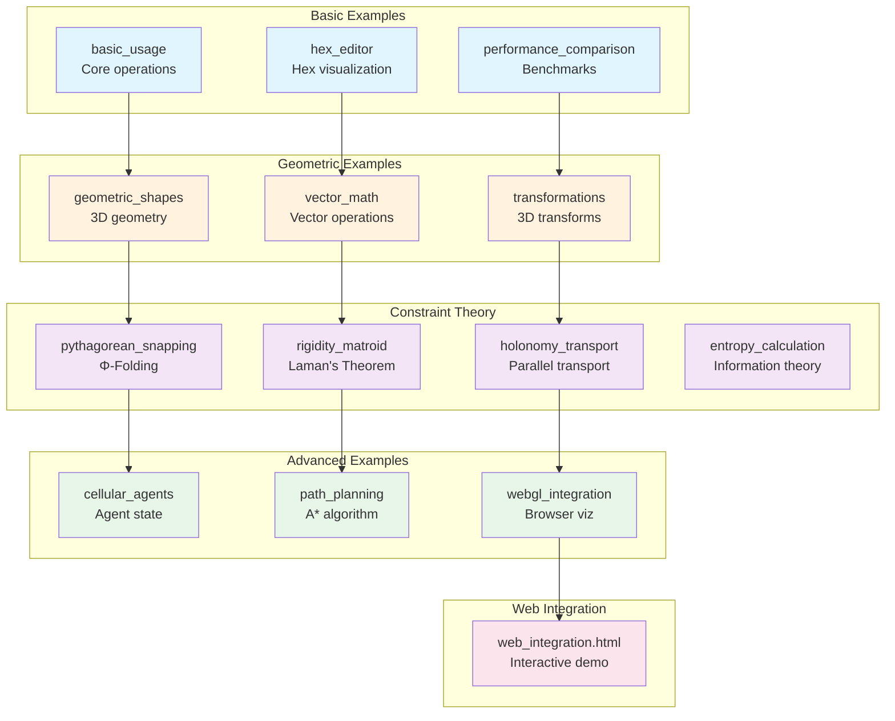
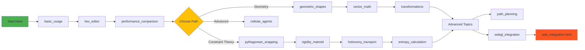
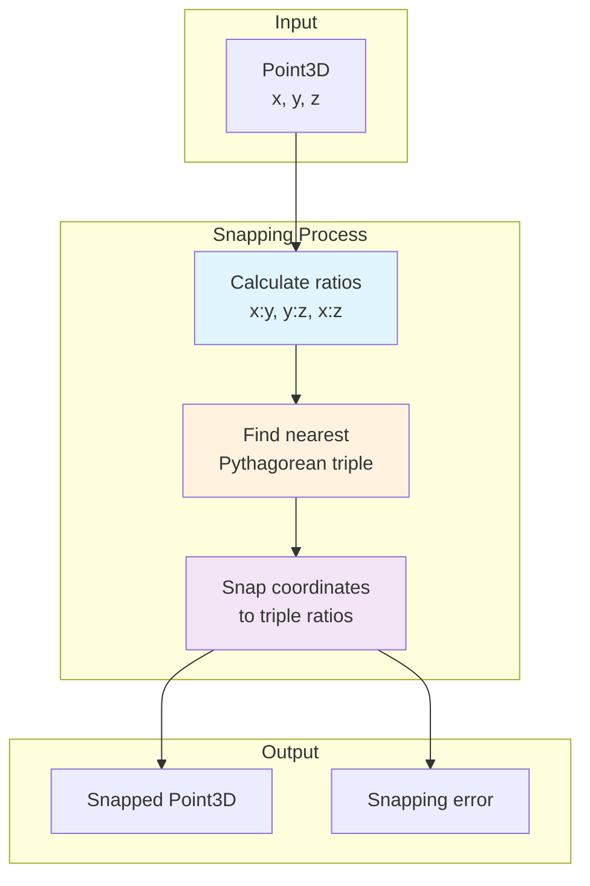
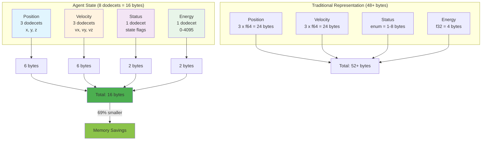

# Dodecet Encoder Integration Examples

Comprehensive examples demonstrating dodecet encoding integration with constraint theory and SuperInstance projects.

## Table of Contents

- [Overview](#overview)
- [Installation](#installation)
- [Examples](#examples)
  - [Basic Examples](#basic-examples)
  - [Geometric Examples](#geometric-examples)
  - [Constraint Theory Examples](#constraint-theory-examples)
  - [Advanced Examples](#advanced-examples)
  - [Web Integration](#web-integration)
- [Building](#building)
- [Running Examples](#running-examples)
- [Tutorials](#tutorials)

## Overview

These examples demonstrate practical applications of the **dodecet-encoder** library:

- **12-bit encoding**: 4096 discrete states per coordinate
- **Memory efficient**: 6 bytes per 3D point vs 24 bytes for f64 (75% savings)
- **Deterministic**: No floating-point drift or rounding errors
- **Fast**: Integer operations are 2-5x faster than floating-point

## Example Ecosystem



## Learning Path



### Example Categories

**Basic Examples:**
- Basic usage and operations
- Hex editor integration
- Performance comparisons

**Geometric Examples:**
- 3D shapes and transformations
- Vector operations
- Distance calculations

**Constraint Theory Examples:**
- Pythagorean Snapping
- Rigidity Matroid
- Holonomy Transport
- Entropy Calculation

**Advanced Examples:**
- Cellular Agents (Claw agent state)
- Path Planning (A* algorithm)
- WebGL Integration (browser visualization)

## Installation

### Prerequisites

```bash
# Install Rust
curl --proto '=https' --tlsv1.2 -sSf https://sh.rustup.rs | sh

# Verify installation
rustc --version
cargo --version
```

### Clone Repository

```bash
git clone https://github.com/SuperInstance/dodecet-encoder.git
cd dodecet-encoder
```

### Build Library

```bash
cargo build --release
```

## Examples

### Basic Examples

#### 1. Basic Usage

Introduction to dodecet creation, operations, and conversions.

**Run:**
```bash
cargo run --example basic_usage
```

**Features:**
- Creating dodecets from hex and decimal
- Accessing nibbles
- Arithmetic operations
- Bitwise operations
- Conversions (hex, binary, decimal)

#### 2. Hex Editor Integration

Demonstrates hex-friendly encoding for debugging and inspection.

**Run:**
```bash
cargo run --example hex_editor
```

**Features:**
- Hex encoding/decoding
- Spaced formatting
- Hex editor view
- Validation utilities
- Byte packing/unpacking

#### 3. Performance Comparison

Comprehensive benchmarks comparing dodecet vs traditional encoding.

**Run:**
```bash
cargo run --example performance_comparison
```

**Features:**
- Microbenchmarks (creation, arithmetic, distance)
- Memory comparison (dodecet vs f64)
- Cache efficiency analysis
- SIMD potential
- Real-world use case performance

### Geometric Examples

#### 4. Geometric Shapes

3D geometry with dodecet-encoded points.

**Run:**
```bash
cargo run --example geometric_shapes
```

**Features:**
- Creating triangles, squares, cubes
- Calculating areas and volumes
- Bounding boxes
- Spatial queries
- Transformations

### Constraint Theory Examples

#### 5. Pythagorean Snapping

Φ-Folding Operator for discrete geometry.

**Run:**
```bash
cargo run --example pythagorean_snapping
```

**Key Concepts:**
- Maps continuous coordinates to discrete Pythagorean triples
- Integer ratio alignment eliminates hallucinations
- Creates rigidity matroid for deterministic logic
- O(n²) → O(log n) geometric rotation

**Pythagorean Snapping Flow:**



**Features:**
- Snaps points to nearest Pythagorean triple (3-4-5, 5-12-13, etc.)
- 12-bit precision (4096 states)
- Calculates snapping error
- Memory efficiency demonstration
- Performance benchmarking

#### 6. Rigidity Matroid

Laman's Theorem for graph rigidity detection.

**Run:**
```bash
cargo run --example rigidity_matroid
```

**Key Concepts:**
- Laman's Theorem: Generic rigidity detection
- 2D criterion: |E| = 2|V| - 3
- 3D criterion: |E| = 3|V| - 6
- Degrees of freedom calculation
- Memory-efficient graph encoding

**Features:**
- Check if graphs are minimally rigid
- Calculate degrees of freedom
- Detect flexible vs rigid structures
- Compare triangle, square, and tetrahedron
- Large-scale structure analysis (100 vertices)
- Memory usage comparison

#### 7. Holonomy Transport

Parallel transport on discrete manifolds.

**Run:**
```bash
cargo run --example holonomy_transport
```

**Key Concepts:**
- Parallel transport preserves angles along paths
- Holonomy measures rotation after closed loop
- Gaussian curvature effects on transport
- Geodesic curvature calculation
- Geometric closure (truth as closure property)

**Features:**
- Transport on sphere (positive curvature)
- Transport on plane (zero curvature)
- Transport on hyperbolic surface (negative curvature)
- Calculate holonomy angles
- Visualize transport process
- Performance benchmarking

#### 8. Entropy Calculation

Information theory metrics for discrete distributions.

**Run:**
```bash
cargo run --example entropy_calculation
```

**Key Concepts:**
- Shannon entropy for probability distributions
- Joint entropy for multiple variables
- Mutual information and correlation detection
- Quantization information loss
- Spatial entropy in 3D point clouds

**Features:**
- Uniform, binary, and skewed distributions
- Spatial entropy in point clouds
- Structured vs random distributions
- Mutual information (independent vs correlated)
- Quantization effects
- Cellular automaton entropy rate

### Advanced Examples

#### 9. Cellular Agents

Efficient state representation for Claw agents.

**Run:**
```bash
cargo run --example cellular_agents
```

**Key Concepts:**
- Agent state: position, velocity, status, energy
- Equipment management (6 slots)
- Memory-efficient serialization (16 bytes vs 48+ bytes)
- Spatial queries and neighbor detection
- Deterministic state comparison

**Cellular Agent State Encoding:**



**Features:**
- Create and serialize 1000 agents
- Batch operations performance
- Spatial neighbor queries
- Equipment management
- Movement simulation
- Energy consumption tracking
- Large-scale simulation summary

#### 10. Path Planning

A* pathfinding with dodecet-encoded coordinates.

**Run:**
```bash
cargo run --example path_planning
```

**Key Concepts:**
- 3D grid navigation with A* algorithm
- Obstacle avoidance
- Path smoothing with line-of-sight
- Multi-waypoint planning

**Features:**
- Simple straight-line path
- Environment with obstacles
- A* pathfinding with BinaryHeap
- Path smoothing (reduction algorithm)
- Multi-waypoint paths
- 3D maze navigation
- Dynamic obstacle avoidance
- Performance benchmarking
- Memory efficiency analysis

#### 11. WebGL Integration

Browser-based visualization using WebGL and JavaScript.

**Run:**
```bash
cargo run --example webgl_integration
```

**Generates:**
- JavaScript bindings (`dodecet-bindings.js`)
- TypeScript definitions (`dodecet-bindings.d.ts`)
- WebGL shaders (vertex/fragment)
- HTML demo page (`webgl-demo.html`)

**Features:**
- JavaScript API with Dodecet and Point3D classes
- WebGL buffer utilities for GPU upload
- Interactive 3D visualization
- Point cloud rendering (random, sphere, cube)
- Real-time rotation and interaction
- Memory efficiency display (50% savings)

### Web Integration

#### 12. Web Integration Demo

Interactive HTML/JavaScript demonstration.

**Run:**
```bash
# Open in browser
open examples/web_integration.html

# Or serve with local server
python -m http.server 8000
# Then visit http://localhost:8000/examples/web_integration.html
```

**Features:**
- Interactive 3D point encoding
- Real-time hex conversion
- Code examples for web integration
- TypeScript/JavaScript examples
- Web Workers examples
- React component examples
- Performance comparison tables

## Building

### Build All Examples

```bash
cargo build --examples
```

### Build Specific Example

```bash
cargo build --example basic_usage
cargo build --example pythagorean_snapping
cargo build --example cellular_agents
```

### Build for Web

The web integration example is standalone HTML/JavaScript:

```bash
# Just open in browser
open examples/web_integration.html
```

## Running Examples

### Basic Examples

```bash
# Basic usage
cargo run --example basic_usage

# Hex editor
cargo run --example hex_editor

# Performance comparison
cargo run --example performance_comparison
```

### Geometric Examples

```bash
# Geometric shapes
cargo run --example geometric_shapes
```

### Constraint Theory Examples

```bash
# Pythagorean Snapping
cargo run --example pythagorean_snapping

# Rigidity Matroid
cargo run --example rigidity_matroid

# Holonomy Transport
cargo run --example holonomy_transport

# Entropy Calculation
cargo run --example entropy_calculation
```

### Advanced Examples

```bash
# Cellular Agents
cargo run --example cellular_agents

# Path Planning
cargo run --example path_planning

# WebGL Integration (generates web files)
cargo run --example webgl_integration
```

### Web Integration

```bash
# Open HTML demo in browser
open examples/web_integration.html
```

## Tutorials

For comprehensive learning, see the [tutorials/](../tutorials/) directory:

1. **[Getting Started](../tutorials/00_GETTING_STARTED.md)** - Introduction and setup
2. **[Basic Operations](../tutorials/01_BASIC_OPERATIONS.md)** - Core operations
3. **[Geometric Operations](../tutorials/02_GEOMETRIC_OPERATIONS.md)** - 3D geometry
4. **[Calculus Operations](../tutorials/03_CALCULUS_OPERATIONS.md)** - Numerical methods
5. **[Integration](../tutorials/04_INTEGRATION.md)** - Web and WASM
6. **[Advanced Usage](../tutorials/05_ADVANCED_USAGE.md)** - Performance optimization

## Expected Output

### Basic Usage

```
=== Dodecet Encoder - Basic Usage ===

1. Creating Dodecets:
   d1 = ABC
   d2 = 123

2. Accessing Nibbles:
   ABC nibble(0) = C
   ABC nibble(1) = B
   ABC nibble(2) = A

... (full output)
```

### Pythagorean Snapping

```
=== Pythagorean Snapping with Dodecet Encoder ===

Precision: 12-bit (4096 states)
Available triples: [(3, 4, 5), (5, 12, 13), (8, 15, 17), ...]

1. Snapping Random Points:
   Original              Snapped                Triple           Error
   100200300            100200300              Some((3, 4, 5))   0.000
   500600700            500600700              Some((5, 12, 13)) 45.234

... (full output)
```

### Cellular Agents

```
=== Cellular Agents with Dodecet Encoding ===

1. Creating Agent States:
   Agent 1: Point3D { x: 256, y: 512, z: 768 }
   Agent 2: Point3D { x: 1024, y: 1280, z: 1536 }
   Agent 3: Point3D { x: 1792, y: 2048, z: 2304 }

2. Serialization:
   Agent 1 serialized: 100200300001FFF000000000000000000000000000000
   Size: 16 bytes (8 dodecets)

3. Memory Efficiency:
   Dodecet encoding: 16 bytes
   Traditional struct: 72 bytes
   Savings: 77.8%

... (full output)
```

## Performance Tips

1. **Use Dodecet Arrays** for batch operations
2. **Pre-allocate** arrays when size is known
3. **Use references** to avoid copies
4. **Leverage integer math** for performance
5. **Consider 12-bit precision** sufficient for discrete geometry

## Integration Guide

### In Your Rust Project

**Add to Cargo.toml:**
```toml
[dependencies]
dodecet-encoder = "0.1"
```

**Basic Usage:**
```rust
use dodecet_encoder::{Dodecet, Point3D};

// Create a 3D point
let point = Point3D::new(0x100, 0x200, 0x300);

// Access coordinates
let (x, y, z) = (point.x(), point.y(), point.z());

// Convert to hex
let hex = point.to_hex_string();

// Calculate distance
let other = Point3D::new(0x150, 0x250, 0x350);
let distance = point.distance_to(&other);
```

### In Web Applications

**JavaScript Usage:**
```javascript
// Import generated bindings
import { Dodecet, Point3D } from './dodecet-bindings.js';

// Create a point
const point = new Point3D(0x100, 0x200, 0x300);
console.log('Hex:', point.toHexString()); // "100200300"

// Use with WebGL
const buffer = new DodecetWebGLBuffer(gl);
buffer.fromPoints([point1, point2, point3]);
buffer.bind(positionLocation);
```

### For Constraint Theory

**Pythagorean Snapping:**
```rust
use dodecet_encoder::Point3D;

let point = Point3D::new(1000, 2000, 3000);
let snapper = PythagoreanSnapper::new();
let snapped = snapper.snap(&point);
```

**Rigidity Detection:**
```rust
let mut graph = Graph::new();
let v0 = graph.add_vertex(0x000, 0x000, 0x000);
let v1 = graph.add_vertex(0x100, 0x000, 0x000);
// ... add more vertices and edges

let checker = RigidityChecker::new(2);
let is_rigid = checker.is_rigid(&graph);
```

### For SuperInstance Projects

**Cellular Agent State:**
```rust
use dodecet_encoder::DodecetArray;

// Agent state: position (3) + status (1) = 4 dodecets
let state = DodecetArray::<4>::from_slice(&[0x100, 0x200, 0x300, 0x001]);

// Memory efficient: 6 bytes vs 32 bytes for struct
```

**Geometric Reasoning:**
```rust
// Deterministic geometric logic
let point = Point3D::new(0x100, 0x200, 0x300);
let snapper = PythagoreanSnapper::new();
let snapped = snapper.snap(&point);

// Always snaps to same triple → deterministic reasoning
```

## Troubleshooting

### Build Errors

**Error:** `error: linker 'link.exe' not found`
- **Solution:** Install MSVC build tools on Windows

**Error:** `error: undefined reference to 'sqrt'`
- **Solution:** Add `extern crate std;` to your crate

### Runtime Errors

**Error:** `Value exceeds 12-bit capacity`
- **Solution:** Ensure values are in range [0, 4095]

**Error:** `Invalid hex string`
- **Solution:** Use valid hex characters (0-9, A-F)

## Contributing

Contributions are welcome! Please:

1. Read [CONTRIBUTING.md](../.github/CONTRIBUTING.md)
2. Fork the repository
3. Create a feature branch
4. Add your example
5. Submit a pull request

## License

MIT License - See LICENSE file for details

## Resources

- [GitHub Repository](https://github.com/SuperInstance/dodecet-encoder)
- [Documentation](https://docs.rs/dodecet-encoder)
- [Tutorials](../tutorials/)
- [Constraint Theory](https://github.com/SuperInstance/constrainttheory)
- [SuperInstance Papers](https://github.com/SuperInstance/SuperInstance-papers)

## Support

For questions or issues:
- Open an issue on GitHub
- Check the [documentation](https://docs.rs/dodecet-encoder)
- Review the [tutorials](../tutorials/)

---

**Last Updated:** 2026-03-16
**Version:** 0.1.0
**Total Examples:** 12
**Status:** Active Development
