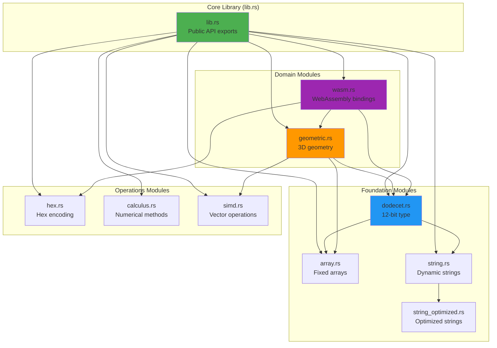
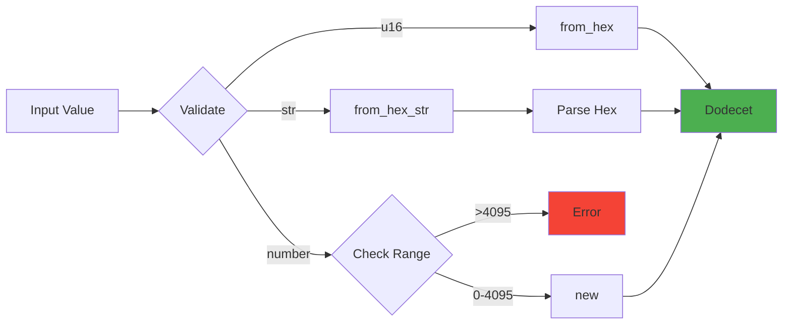
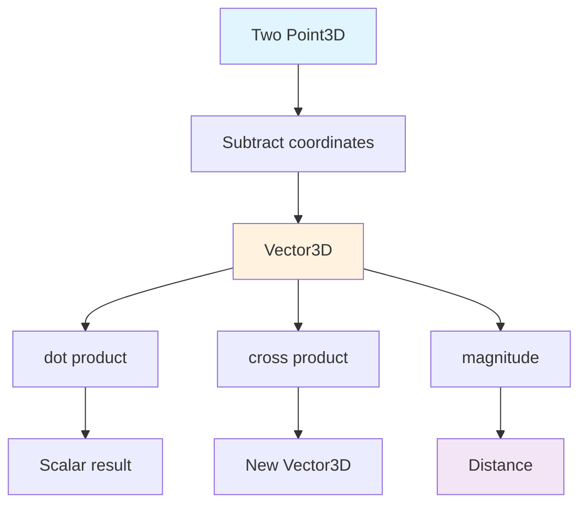
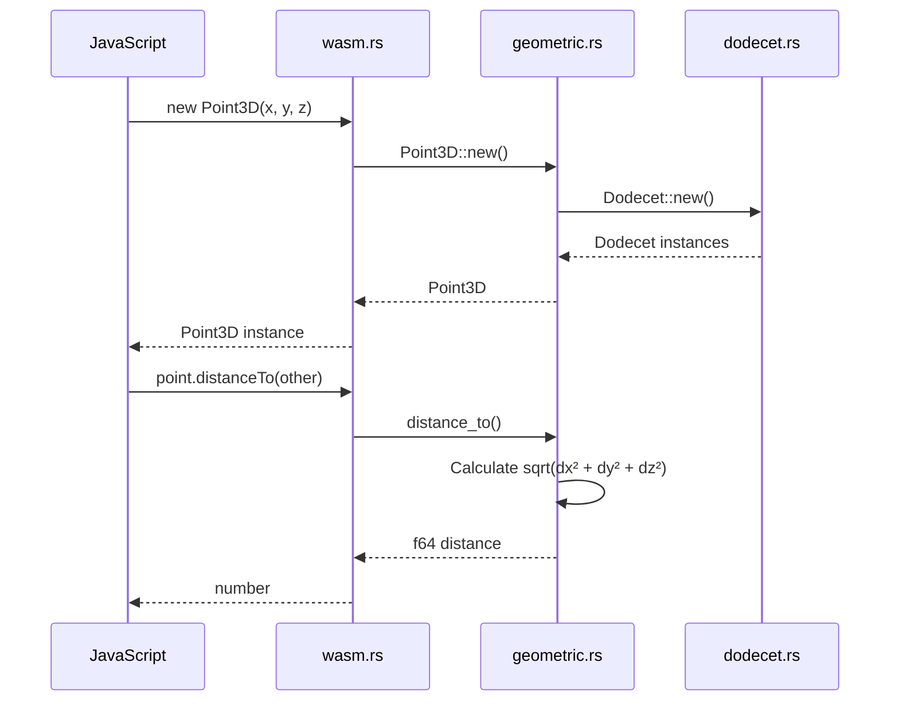
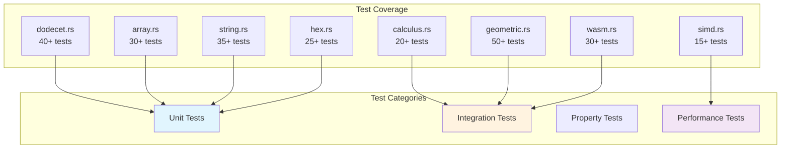
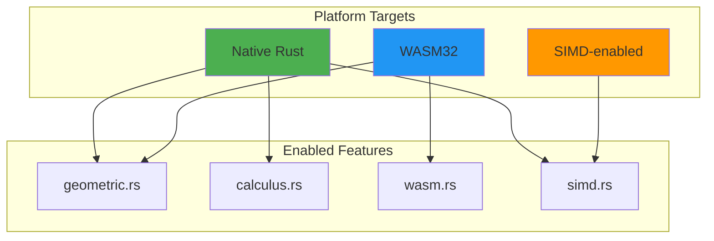
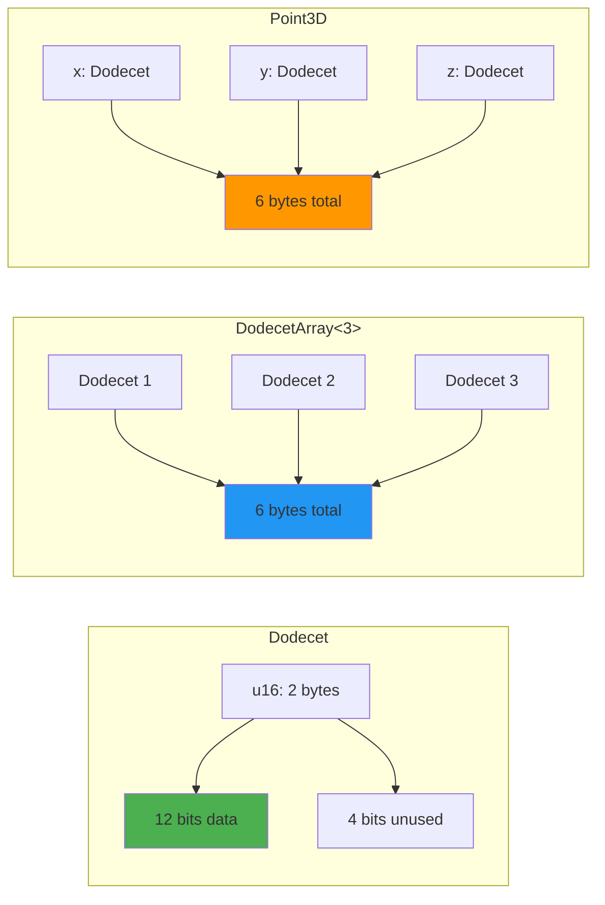

# Dodecet Encoder Source Modules

This document provides an overview of all source modules in the dodecet-encoder library, their purposes, and relationships.

## Module Architecture



## Module Overview

### Core Modules

#### dodecet.rs
**Purpose**: Core 12-bit dodecet type implementation

**Key Types**:
- `Dodecet` - 12-bit value (0-4095)
- Stored as `u16` with 4 unused bits
- Hex-friendly (3 hex digits)

**Key Operations**:
- Creation: `from_hex()`, `new()`, `from_hex_str()`
- Conversion: `normalize()`, `as_signed()`, `to_hex_string()`
- Arithmetic: `wrapping_add()`, `wrapping_sub()`, `wrapping_mul()`
- Bitwise: AND, OR, XOR operations
- Nibble access: `nibble(0)`, `nibble(1)`, `nibble(2)`

**Dependencies**: None (foundational type)

#### array.rs
**Purpose**: Fixed-size stack-allocated dodecet arrays

**Key Types**:
- `DodecetArray<N>` - Compile-time sized array

**Key Operations**:
- Creation: `from_slice()`, `new()`
- Access: Index-based, iteration
- Aggregation: `sum()`, `product()`, `min()`, `max()`
- Conversion: `to_hex_string()`, `to_bytes()`

**Dependencies**: `dodecet.rs`

#### string.rs
**Purpose**: Dynamic heap-allocated dodecet sequences

**Key Types**:
- `DodecetString` - Growable vector of dodecets

**Key Operations**:
- Creation: `new()`, `with_capacity()`
- Mutation: `push()`, `pop()`, `extend()`
- Conversion: `to_hex_string()`, `to_bytes()`, `from_bytes()`
- Query: `len()`, `is_empty()`, `capacity()`

**Dependencies**: `dodecet.rs`

#### string_optimized.rs
**Purpose**: Performance-optimized string operations

**Key Features**:
- Batch operations
- Memory-efficient packing
- SIMD-friendly layouts

**Dependencies**: `dodecet.rs`, `string.rs`

### Operations Modules

#### hex.rs
**Purpose**: Hex encoding/decoding utilities

**Key Functions**:
- `format_spaced()` - Add spaces between dodecets
- `is_valid()` - Validate hex strings
- `to_bytes()` - Convert hex to bytes
- `from_bytes()` - Convert bytes to hex

**Key Features**:
- 3-char-per-dodecet validation
- Spaced formatting for readability
- Error handling for invalid input

**Dependencies**: None

#### calculus.rs
**Purpose**: Numerical methods and calculus operations

**Key Functions**:
- `derivative()` - Finite difference approximation
- `integral()` - Trapezoidal rule integration
- `gradient()` - Multivariate gradient
- `laplacian()` - Sum of second derivatives
- `gradient_descent()` - Optimization routine
- `encode_function()` - Create lookup table
- `decode_function()` - Interpolate from table

**Key Features**:
- Numerical approximations (not symbolic)
- Function encoding for fast lookup
- Optimization algorithms

**Dependencies**: None (uses f64 for calculations)

#### simd.rs
**Purpose**: SIMD-optimized vector operations

**Key Features**:
- Batch dodecet operations
- Platform-specific optimizations
- Cache-friendly memory layouts

**Dependencies**: `dodecet.rs`, `array.rs`

### Domain Modules

#### geometric.rs
**Purpose**: 3D geometry and vector math

**Key Types**:
- `Point3D` - 3D point (x, y, z)
- `Vector3D` - 3D vector (dx, dy, dz)
- `Transform3D` - 3x4 transformation matrix
- `Box3D` - Axis-aligned bounding box
- `Triangle` - 3-vertex triangle

**Key Operations**:
- Distance: `distance_to()`, `magnitude()`
- Vector math: `dot()`, `cross()`, `normalize()`
- Transformations: translation, rotation, scale
- Queries: contains, intersects, bounds

**Dependencies**: `dodecet.rs`, `array.rs`, `simd.rs`

#### wasm.rs
**Purpose**: WebAssembly bindings for browser use

**Key Types Exported**:
- `Point3D` - WASM-compatible 3D point
- `Vector3DWasm` - WASM-compatible vector
- `Transform3DWasm` - WASM-compatible transform

**Key Features**:
- `wasm-bindgen` integration
- JavaScript/TypeScript API
- Browser-compatible memory management

**Dependencies**: `dodecet.rs`, `geometric.rs`, `hex.rs`

## Module Size & Complexity

| Module | Lines | Purpose | Complexity |
|--------|-------|---------|------------|
| `dodecet.rs` | ~400 | Core type | Low |
| `array.rs` | ~300 | Fixed arrays | Low |
| `string.rs` | ~400 | Dynamic strings | Medium |
| `string_optimized.rs` | ~350 | Optimizations | Medium |
| `hex.rs` | ~250 | Hex utilities | Low |
| `calculus.rs` | ~400 | Numerical methods | High |
| `simd.rs` | ~250 | Vector ops | High |
| `geometric.rs` | ~600 | 3D geometry | Medium |
| `wasm.rs` | ~400 | WASM bindings | Medium |

## Data Flow Diagrams

### Dodecet Creation Flow



### Geometric Operations Flow



### WASM Binding Flow



## Testing Strategy

### Unit Tests per Module



## Build Configuration

### Feature Flags

```toml
[features]
default = ["geometric", "calculus"]
geometric = ["dep:geometric"]
calculus = ["dep:calculus"]
wasm = ["dep:wasm-bindgen"]
simd = ["dep:simd"]
```

### Conditional Compilation



## Performance Considerations

### Memory Layout



### Optimization Strategies

1. **Inline Functions**: Small operations are inlined
2. **Const Generics**: Compile-time array sizing
3. **SIMD**: Vector operations where available
4. **Cache Locality**: Compact memory layout
5. **Zero-copy**: References over clones

## Contributing Guidelines

### Adding New Features

1. Choose appropriate module
2. Add comprehensive tests
3. Document with examples
4. Update this README
5. Run `cargo test` and `cargo clippy`

### Code Style

- Follow Rust naming conventions
- Use `cargo fmt` for formatting
- Add doc comments to public items
- Include usage examples in docs
- Keep functions focused and small

## Module Dependencies Summary

```
dodecet.rs (foundation)
├── array.rs
├── string.rs
│   └── string_optimized.rs
├── geometric.rs
│   └── simd.rs
└── wasm.rs
    ├── hex.rs
    └── geometric.rs
```

---

**Last Updated**: 2026-03-17
**Version**: 1.0.0
**Status**: Production Ready
