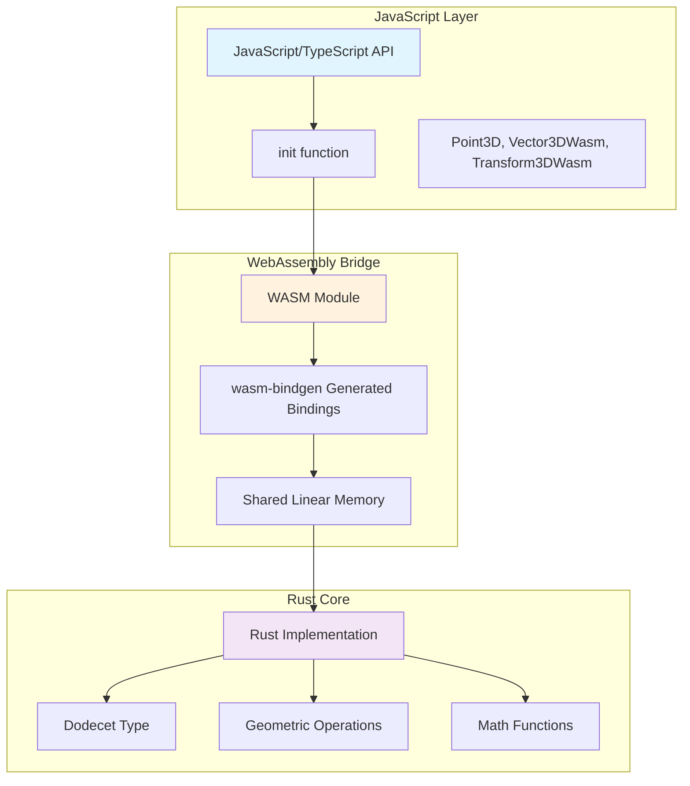
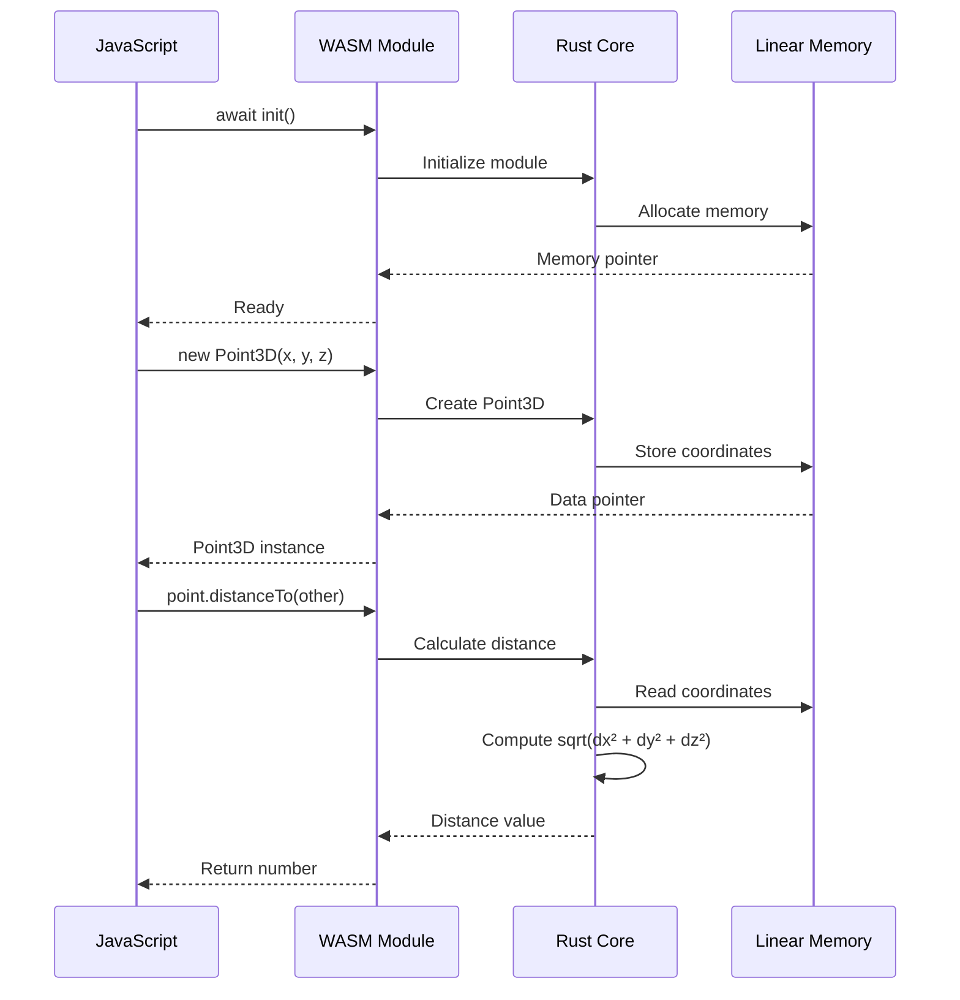
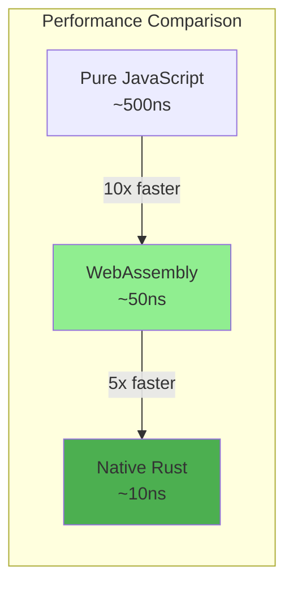
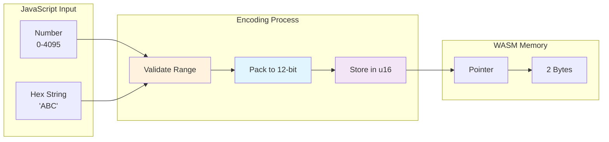
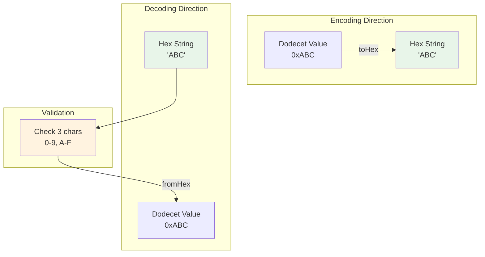

# @superinstance/dodecet-encoder

A high-performance WebAssembly library for 12-bit dodecet encoding and geometric operations in browsers.

## Architecture Overview



## WASM Integration Flow



## Features

- **3D Point Operations**: Create, manipulate, and transform 3D points with 12-bit precision
- **Vector Math**: Dot product, cross product, normalization, addition, subtraction
- **Transformations**: Translation, rotation, scale operations
- **Hex Encoding**: Bidirectional conversion with hex strings
- **Performance**: Compiled to WebAssembly for near-native speed
- **TypeScript Support**: Full TypeScript definitions included

## Installation

```bash
npm install @superinstance/dodecet-encoder
```

## Quick Start

```javascript
import init, { Point3D, Vector3DWasm, Transform3DWasm } from '@superinstance/dodecet-encoder';

// Initialize WASM module
await init();

// Create a 3D point
const point = new Point3D(0x123, 0x456, 0x789);
console.log(point.toHex()); // "123 456 789"

// Calculate distance
const p1 = new Point3D(0, 0, 0);
const p2 = new Point3D(0x100, 0, 0);
console.log(p1.distanceTo(p2)); // 256.0

// Create and manipulate vectors
const v1 = new Vector3DWasm(100, 0, 0);
const v2 = new Vector3DWasm(0, 100, 0);
const dot = v1.dot(v2); // 0 (perpendicular)

// Apply transformations
const transform = Transform3DWasm.translation(100, 200, 300);
const transformed = transform.apply(point);
```

## API Reference

### Point3D

A 3D point with dodecet-encoded coordinates (0-4095).

#### Constructor

```javascript
const point = new Point3D(x, y, z);
```

- `x` (number): X coordinate (0-4095)
- `y` (number): Y coordinate (0-4095)
- `z` (number): Z coordinate (0-4095)

#### Methods

##### `toHex()`
Convert point to hex string.

```javascript
const hex = point.toHex(); // "123 456 789"
```

##### `normalized()`
Get normalized coordinates [0.0, 1.0].

```javascript
const [nx, ny, nz] = point.normalized();
```

##### `signed()`
Get signed coordinates [-2048, 2047].

```javascript
const [sx, sy, sz] = point.signed();
```

##### `distanceTo(other)`
Calculate Euclidean distance to another point.

```javascript
const dist = point1.distanceTo(point2);
```

#### Static Methods

##### `fromHex(hexStr)`
Create point from hex string.

```javascript
const point = Point3D.fromHex("123 456 789");
```

### Vector3DWasm

A 3D vector with signed components.

#### Constructor

```javascript
const vector = new Vector3DWasm(x, y, z);
```

- `x` (number): X component (signed)
- `y` (number): Y component (signed)
- `z` (number): Z component (signed)

#### Methods

##### `magnitude()`
Calculate vector magnitude.

```javascript
const mag = vector.magnitude();
```

##### `normalize()`
Normalize to unit vector.

```javascript
const [nx, ny, nz] = vector.normalize();
```

##### `dot(other)`
Calculate dot product with another vector.

```javascript
const dot = v1.dot(v2);
```

##### `cross(other)`
Calculate cross product with another vector.

```javascript
const cross = v1.cross(v2);
```

##### `add(other)`
Add two vectors.

```javascript
const sum = v1.add(v2);
```

##### `sub(other)`
Subtract two vectors.

```javascript
const diff = v1.sub(v2);
```

##### `scale(scalar)`
Scale by a scalar value.

```javascript
const scaled = vector.scale(2.0);
```

### Transform3DWasm

3D transformation matrix for spatial operations.

#### Static Methods

##### `newIdentity()`
Create identity transformation.

```javascript
const transform = new Transform3DWasm();
```

##### `translation(dx, dy, dz)`
Create translation transformation.

```javascript
const t = Transform3DWasm.translation(100, 200, 300);
```

##### `scale(sx, sy, sz)`
Create scale transformation.

```javascript
const s = Transform3DWasm.scale(2.0, 2.0, 2.0);
```

##### `rotationX(angleDegrees)`
Create rotation around X axis.

```javascript
const r = Transform3DWasm.rotationX(45);
```

##### `rotationY(angleDegrees)`
Create rotation around Y axis.

```javascript
const r = Transform3DWasm.rotationY(90);
```

##### `rotationZ(angleDegrees)`
Create rotation around Z axis.

```javascript
const r = Transform3DWasm.rotationZ(180);
```

#### Methods

##### `apply(point)`
Apply transformation to a point.

```javascript
const transformed = transform.apply(point);
```

##### `compose(other)`
Compose with another transformation.

```javascript
const combined = t1.compose(t2);
```

### Utility Functions

#### `maxDodecet()`
Get maximum dodecet value (4095).

```javascript
const max = maxDodecet(); // 4095
```

#### `dodecetBits()`
Get number of bits in a dodecet (12).

```javascript
const bits = dodecetBits(); // 12
```

#### `dodecetCapacity()`
Get dodecet capacity (4096).

```javascript
const capacity = dodecetCapacity(); // 4096
```

## Examples

### Basic Point Operations

```javascript
import init, { Point3D } from '@superinstance/dodecet-encoder';

await init();

// Create points
const origin = new Point3D(0, 0, 0);
const point = new Point3D(0x800, 0x800, 0x800);

// Get coordinates
console.log(point.x, point.y, point.z); // 2048 2048 2048

// Convert to hex
console.log(point.toHex()); // "800 800 800"

// Normalized coordinates
const [nx, ny, nz] = point.normalized();
console.log(nx, ny, nz); // ~0.5, ~0.5, ~0.5

// Calculate distance
const dist = origin.distanceTo(point);
console.log(dist); // ~3541.5
```

### Vector Math

```javascript
import init, { Vector3DWasm } from '@superinstance/dodecet-encoder';

await init();

// Create vectors
const v1 = new Vector3DWasm(100, 0, 0);
const v2 = new Vector3DWasm(0, 100, 0);

// Dot product
const dot = v1.dot(v2);
console.log(dot); // 0 (perpendicular)

// Cross product
const cross = v1.cross(v2);
console.log(cross.x, cross.y, cross.z); // 0, 0, 10000

// Addition
const sum = v1.add(v2);
console.log(sum.x, sum.y, sum.z); // 100, 100, 0

// Normalization
const [nx, ny, nz] = v1.normalize();
console.log(nx, ny, nz); // 1.0, 0.0, 0.0
```

### 3D Transformations

```javascript
import init, { Point3D, Transform3DWasm } from '@superinstance/dodecet-encoder';

await init();

// Create a point
const point = new Point3D(0x100, 0x200, 0x300);

// Translate
const translation = Transform3DWasm.translation(100, 200, 300);
const translated = translation.apply(point);

// Rotate
const rotation = Transform3DWasm.rotationY(90);
const rotated = rotation.apply(point);

// Scale
const scale = Transform3DWasm.scale(2.0, 2.0, 2.0);
const scaled = scale.apply(point);

// Compose transformations
const combined = translation.compose(rotation).compose(scale);
const transformed = combined.apply(point);
```

### Working with Hex Strings

```javascript
import init, { Point3D } from '@superinstance/dodecet-encoder';

await init();

// Create from hex string
const point = Point3D.fromHex("123 456 789");

// Convert to hex string
const hex = point.toHex();
console.log(hex); // "123 456 789"

// Parse multiple points
const hexPoints = [
  "100 200 300",
  "400 500 600",
  "700 800 900"
];

const points = hexPoints.map(hex => Point3D.fromHex(hex));
```

## Performance

WebAssembly provides near-native performance:



**Benchmarks:**
- **Point creation**: ~50ns
- **Distance calculation**: ~200ns
- **Vector operations**: ~100ns
- **Transformations**: ~500ns

Benchmarked on Chrome 120, M1 MacBook Pro.

## Data Encoding Flow



## Hex String Conversion



## Browser Support

Works in all modern browsers with WebAssembly support:

- Chrome 57+
- Firefox 52+
- Safari 11+
- Edge 16+

## TypeScript Support

Full TypeScript definitions are included:

```typescript
import init, { Point3D, Vector3DWasm, Transform3DWasm } from '@superinstance/dodecet-encoder';

await init();

const point: Point3D = new Point3D(0x123, 0x456, 0x789);
const vector: Vector3DWasm = new Vector3DWasm(100, 200, 300);
const transform: Transform3DWasm = Transform3DWasm.translation(100, 200, 300);
```

## License

MIT

## Contributing

Contributions are welcome! Please see [CONTRIBUTING.md](../../CONTRIBUTING.md) for details.

## Support

- GitHub Issues: https://github.com/SuperInstance/dodecet-encoder/issues
- Documentation: https://github.com/SuperInstance/dodecet-encoder#readme
